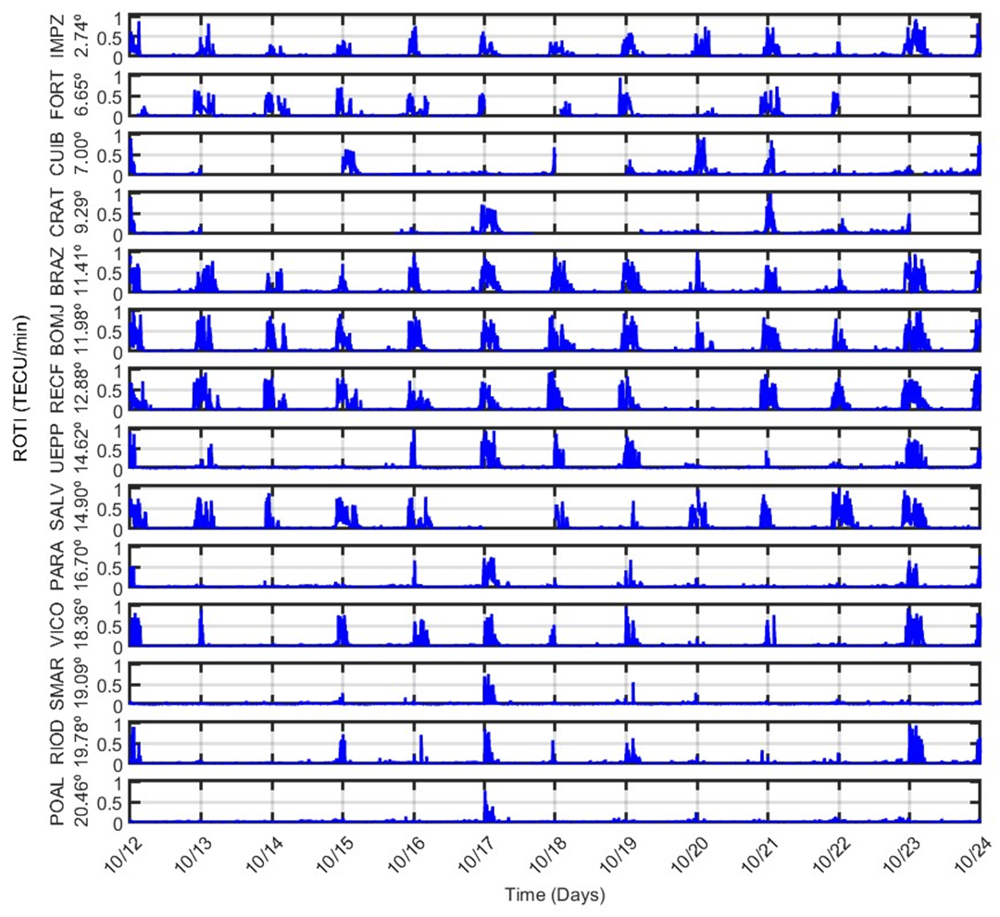

# 📊 Análise de Dados de Estações de Dados Ionosféricos

Este projeto é uma **aplicação MATLAB** que realiza a análise de dados de diferentes estações de dados ionosféricos ao longo de um intervalo de dias. Ele lê os arquivos de dados, identifica lacunas, e plota um gráfico geral composto por gráficos para cada estação, permitindo uma análise visual detalhada da variação do índice ROTI (TECU/min) ao longo do tempo.

## 🚀 Tecnologias Usadas

- **MATLAB**
- **Gráficos e Visualização de Dados**

## 💡 Objetivo

O objetivo deste projeto foi desenvolver um código para:

- Realizar a leitura de arquivos de dados ionosféricos em formato de texto.
- Tratar dados faltantes de maneira eficiente (substituindo por valores `NaN`).
- Gerar gráficos com múltiplas estações de dados ionosféricos, exibindo a variação do índice ROTI (TECU/min) ao longo do tempo.
- Fornecer uma visualização clara e organizada dos dados de várias estações, com formatação e rótulos.

## 🛠 Funcionalidades

- **Leitura de Arquivos de Dados**: O código lê arquivos de texto armazenados localmente, com base no nome da estação e no dia.
- **Tratamento de Dados Faltantes**: Quando não há dados para um dia específico, o código insere `NaN` para indicar lacunas.
- **Criação de Gráficos**: O script gera gráficos para cada estação, com o índice ROTI (TECU/min) no eixo Y e o tempo no eixo X.
- **Visualização em Subgráficos**: Todos os gráficos das estações são dispostos em uma única figura para facilitar a comparação.
- **Rótulos e Formatação**: O gráfico é formatado com rótulos e legendas, e o eixo X exibe as datas de forma legível.

## 📜 Lógica do Código

O código segue a seguinte lógica:

1. **Inicialização e Configuração**:
   - Limpeza do ambiente MATLAB e definição de variáveis iniciais, como o caminho dos arquivos e as estações para monitoramento ionosférico.

2. **Definição de Estações e Dias**:
   - O código define um vetor com os nomes das estações e o intervalo de dias a ser analisado. Também são identificados os dias sem dados para cada estação.

3. **Leitura dos Arquivos de Dados**:
   - O código lê os arquivos de dados para cada estação e dia, verificando se os arquivos existem e não estão vazios. Se não houver dados, o código adiciona valores `NaN`.

4. **Processamento e Criação de Gráficos**:
   - Para cada estação, os dados são processados e plotados em subgráficos. Cada gráfico exibe o índice ROTI ao longo do tempo, e os eixos são ajustados conforme necessário.

5. **Formatação e Exibição**:
   - O código formata a aparência dos gráficos, incluindo a rotação dos rótulos do eixo X e a sincronização dos eixos das subfiguras. O gráfico central recebe um rótulo específico.

## 📜 Como Usar

1. **Configuração**:
   - Altere a variável `folder_path` para o diretório onde seus arquivos de dados estão localizados.
   - Certifique-se de que os arquivos de dados estão no formato esperado (`sorted_sensor_data_<estacao>_<dia>.txt`).

2. **Execução**:
   - Execute o script diretamente no MATLAB. Ele irá ler os arquivos de dados e gerar uma figura com os gráficos das estações.

3. **Visualização**:
   - Os gráficos gerados exibirão as variações do índice ROTI para cada estação, com o tempo no eixo X e o valor ROTI no eixo Y.

## 📜 Licença

Este projeto está licenciado sob a Licença MIT - veja o arquivo LICENSE para mais detalhes.

  

